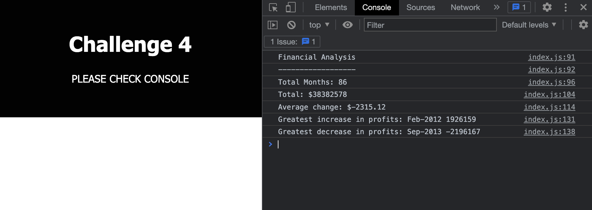

# challenge4-Console-Finances

## Description 
> In challenge 4 I created a code to analyse the financial records where I practised basics of JavaScript. I learned toFixed and got familiarised with sort function.

## Usage 
To access the solution open the below link to deployed application.
* Deployed application - [https://marzena-w.github.io/challenge4-Console-Finances/]
* Right-click -> Inspect
* Go to console
* Screenshot of the challenge4:

## Credits

* For more information about javascript
W3 - [https://www.w3schools.com/jsref/jsref_tofixed.asp]
* To see website updates while making changes to the code
Live Server - [https://marketplace.visualstudio.com/items?itemName=ritwickdey.LiveServer]
* Codecademy - [https://www.codecademy.com/resources/docs/javascript]
* For stackoverflow - [https://stackoverflow.com/]
* Info how to round the number - [https://bobbyhadz.com/blog/javascript-round-number-to-two-decimal-places]

## License
MIT